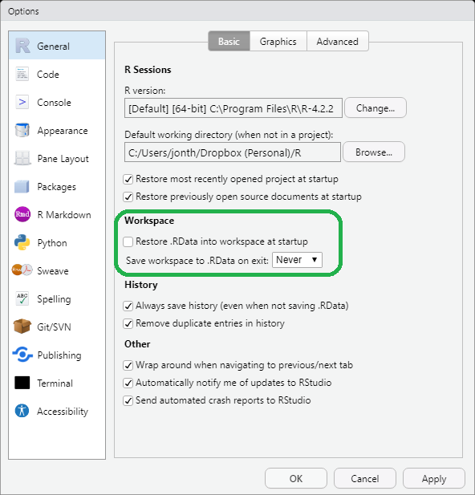
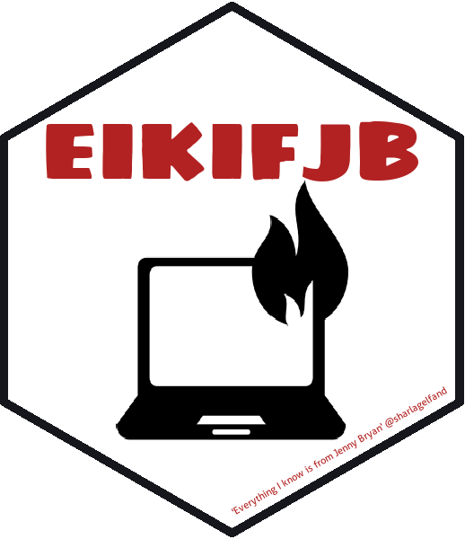

# Saving source and blank slates

**Learning objectives:**

-   List some benefits of working in an IDE.
-   Configure your environment to start from a blank slate.
-   Use hotkeys to restart R and run R code.
-   Explain why `rm(list = ls())` is bad practice.
-   Break analyses into phases and save objects at logical steps.
-   Recognize [{targets}](https://cran.r-project.org/package=targets) as an option for automating workflows.


## Working in an IDE {-}

-   IDE = Integrated Development Environment
-   Run R code without leaving script
-   Discussion: Does anyone use anything other than RStudio? What do you like about it?


## Starting from a Blank Slate {-}

```{r fig.cap = "updated screenshot", out.width = '100%', echo = FALSE}

```


## Hotkeys for Restarting and Running {-}

-   Ctrl/Cmd+Shift+F10 = Restart R. Do this often.
-   Ctrl/Cmd+Alt/Opt+B = Run code from beginning to cursor (`.R`)
-   Ctrl/Cmd+Alt/Opt+SHIFT+P = Run all Previous chunks (`.Rmd`)
-   Ctrl/Cmd+Enter = Run this line
-   Ctrl/Cmd+Shift+Enter = Run this file


## Don't Half-Ass It {-}



-   Lots of people use `rm(list = ls())` to "reset" at top of script, but
-   That only gets visible objects you created

```{r 01-rm-dots, eval = FALSE}
.my_secret <- "you can't kill me!"
rm(list = ls())
.my_secret

#> [1] "you can't kill me!"
```

-   Also [Jenny might set your computer on fire](https://www.tidyverse.org/blog/2017/12/workflow-vs-script/).


## Save Often {-}

-   My #1 fear about restarting often is related to long-running processes...
-   So I should save those via their own piece of the workflow.


## Automated Workflows {-}

-   The book predates {targets}, but that's what she meant to say.
-   If time allows: Let's talk about {targets}!


## Review {-}

-   List some benefits of working in an IDE.
-   Configure your environment to start from a blank slate.
-   Use hotkeys to restart R and run R code.
-   Explain why `rm(list = ls())` is bad practice.
-   Break analyses into phases and save objects at logical steps.
-   Recognize [{targets}](https://cran.r-project.org/package=targets) as an option for automating workflows.


## Meeting Videos {-}

### Cohort 1 {-}

`r knitr::include_url("https://www.youtube.com/embed/nqDlyIKEjn0")`
`r knitr::include_url("https://www.youtube.com/embed/tVTfTSdmWtY")`

<details>
<summary> Meeting chat log </summary>

```
00:28:02	shamsuddeen:	Ok, cool
00:28:34	Jon Harmon (jonthegeek):	https://cran.r-project.org/package=here
00:29:33	Jon Harmon (jonthegeek):	dslc.io/rwtf
00:29:39	Jon Harmon (jonthegeek):	https://www.tidyverse.org/blog/2017/12/workflow-vs-script/
```
</details>
