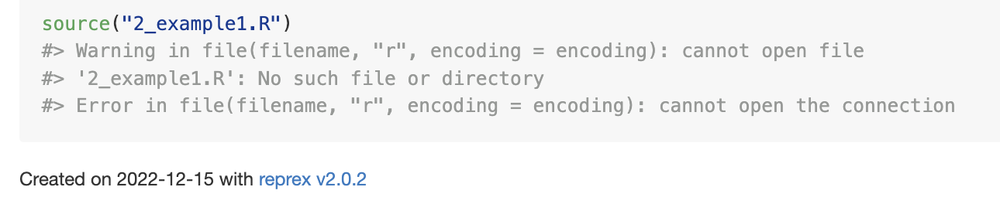
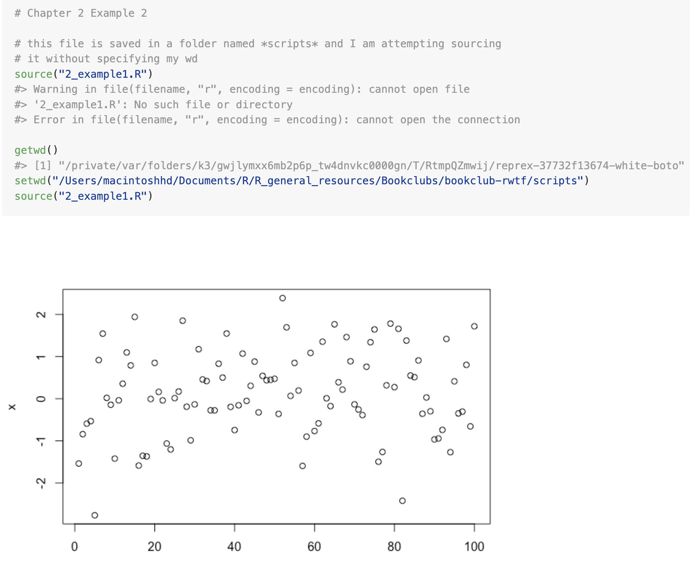

# Project-oriented workflow

**Learning objectives:**

-   Explain why `setwd()` makes it difficult to share code.
-   Describe the structure of a project and how that structure makes code more portable.
-   Use an IDE to work with projects.

## Setting a working directory

There are several way to make your life easier when working on more than one file in RStudio.

It might be helpful to **set a working directory** especially if you use `.R` scripts more than `.Rmd` or `.qmd` files, as these types of files have embedded a *working directory* which is where the files are saved in, while the `.R` scripts have not.

If you'd like to source other files in your `.R` scripts, or save the output in the same folder where your script is saved, it might be a requirement to set a working directory to avoid error warnings.

Let's have a look at some examples:

1.  I saved a .R script on a folder inside this project and named it: `2_example.R`. I am now in a `.Rmd` file so it shouldn't be an issue to source the file's content from here.

```{r echo=FALSE}

```

The file is not found as I need to specify the folder where I positioned it. And it worked!

```{r}
source("scripts/2_example1.R")
```

What happens if I do the same from an `.R` script?

```{r echo=FALSE}

```

Setting a working directory works for the user who set it, but it might be a cause of confusion when working on a team, and other in the team load the file in their machine setting the same working directory. Obviously the path can be easly different, just thinking about the user name of the machine in use and then other files' names can differ as well.

A workaround this is to use **{rstudioapi}** package. As in this example:

```{r}
library(rstudioapi)
```

Here the **wd** is set directly to the `ex1` object in the *scripts* folder:

```{r eval=FALSE}
setwd(getSrcDirectory(ex1))
```

More info about the wd can be retrieved with:

    rstudioapi::getActiveDocumentContext()

```{r echo=FALSE}
rstudioapi::getActiveDocumentContext()
```

In general, if you are in `.R` script and work on a team sharing work, it might be helpful to use:

```{r}
setwd(dirname(rstudioapi::getActiveDocumentContext()$path))
```

```{r}
getwd()
```

Another option is to use **{here}** package:

```{r eval=FALSE}
here::set_here()
```

## Organize work into projects & use an IDE

Create a project on RStudio and store all the files needed for it.

RStudio provides an integrated development environment (IDE) which is a set of tools built to help you be more productive with R.

[source](https://posit.co/download/rstudio-desktop/)


## Meeting Videos {.unnumbered}

### Cohort 1 {.unnumbered}

`r knitr::include_url("https://www.youtube.com/embed/URL")`

<details>

<summary>Meeting chat log</summary>

    LOG

</details>
