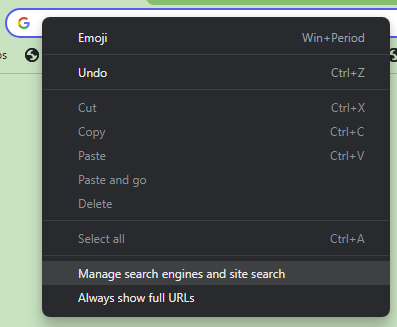
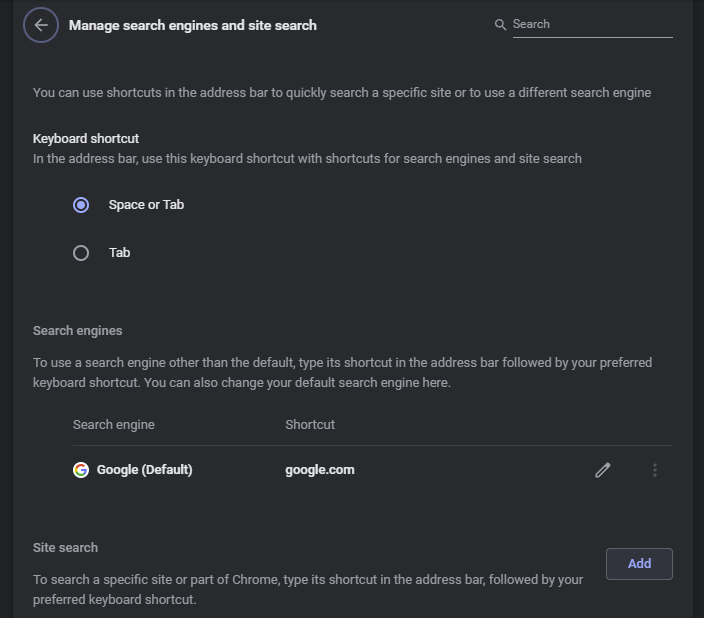
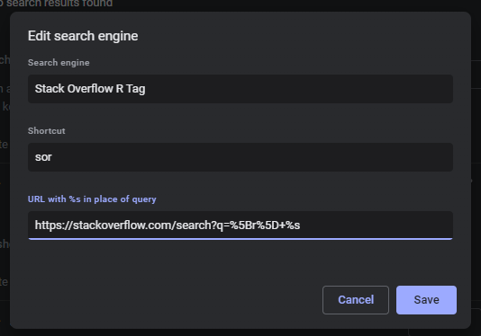

# Read the source

**Learning objectives:**

-   Take some steps to troubleshoot before googling.
-   Improve Google-fu to find help with error messages.
-   Search GitHub for R-related code and issues.
-   Search the CRAN package mirror on GitHub.
-   Navigate to package web pages and repositories.
-   Navigate code in RStudio.

## Have you tried turning it off and back on? {-}

- Remember earlier chapters: 
    -   ctrl-shift-f10 often to restart R
    -   Use RStudio projects

## Search better, not harder! {-}

-   R4DS Online Learning Community
-   [r tag on StackOverflow.com](https://stackoverflow.com/questions/tagged/r)
-   [Advanced search on Posit Community](https://community.rstudio.com/search?expanded=true)
-   Chrome search engines! (etc)

## Chrome search engines {.unlisted .unnumbered}



## Chrome search engines {.unlisted .unnumbered}



## Chrome search engines {.unlisted .unnumbered}



## Chrome search engines {.unlisted .unnumbered}


## Metacran {-}

-   https://github.com/cran
-   Read [GitHub search documentation](https://docs.github.com/en/search-github/getting-started-with-searching-on-github/about-searching-on-github)
-   Another Chrome search engine!
    -   `https://github.com/search?q=org%3Acran+%s`
-   Does NOT include issues!

## Package repos {-}

-   `browse_package()`
-   Search within the repo
-   Be sure to check for recently closed issues and PRs!

## Act locally! {-}

-   `usethis::create_from_github()`
-   ctrl-f and ctrl-shift-f
-   f2 (navigate to the function source)

## Meeting Videos {-}

### Cohort 1 {-}

`r knitr::include_url("https://www.youtube.com/embed/URL")`

<details>
<summary> Meeting chat log </summary>

```
LOG
```
</details>
